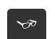
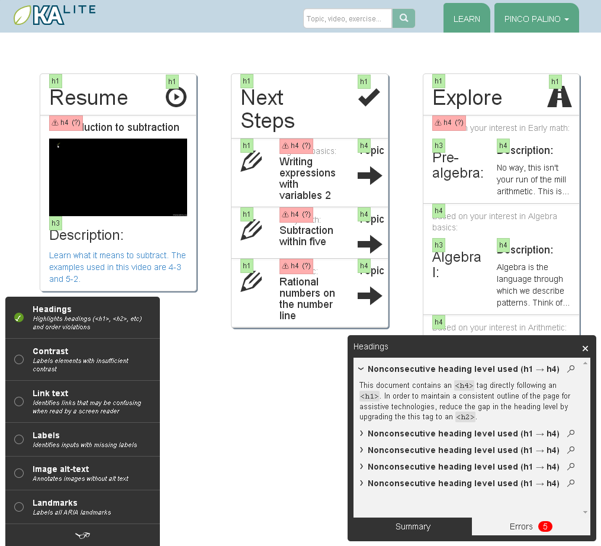

Contribute to make KA Lite accessible to all
============================================

Why
--------------------------------------------

Because inclusive design benefits all users!

* Ensuring that KA Lite is easily navigable with the keyboard will help blind users AND those who cannot use the mouse (or just prefer using the keyboard most of the time).
* Using the appropriate color contrast or making available a high contrast version of KA Lite content will benefit the users with low vision AND all those who need to use it in highly illuminated settings.
* Offering captions and transcripts for KA Lite video content will benefit auditory challenged audience AND improve its comprehension for everybody.
* Maintaining consistent structure, navigation and language will reduce cognitive load for all the audiences AND make it easier for KA Lite content to be localized.

How
--------------------------------------------

For general introduction check the **Accessibility** resources, tools and tips on `KA lite GitHub Wiki pages <https://github.com/learningequality/ka-lite/wiki>`_:

    * `Accessibility Resources (Articles & Links) <https://github.com/learningequality/ka-lite/wiki/Accessibility-Resources-%28Articles-&-Links%29>`_
    * `Accessibility Resources (Tools) <https://github.com/learningequality/ka-lite/wiki/Accessibility-Resources-%28Tools%29>`_
    * `Accessibility Tips & Tricks <https://github.com/learningequality/ka-lite/wiki/Accessibility-Tips-&-Tricks>`_

To make sure you catch the most common a11y pitfalls, use `tota11y <http://khan.github.io/tota11y/>`_ , an accessibility visualization toolkit made available by Khan Academy.

Using tota11y
--------------------------------------------

**tota11y** is integrated into KA Lite that you cloned from GitHub and will be visible in all the pages of your development server **IF** you include ``DEBUG = True`` in your local settings (edit your ``~/.kalite/settings.py`` file).

**tota11y** presents as a small button in the bottom left corner of the document you are viewing.

Once you press the button, it will open a menu of seven checkup-choices each of which you can activate by using the corresponding circle checkbox on the left. In the image bellow you can see the **Headings** activated that "annotates" all the <H> elements in the page and their issues.

This will allow you to keep correcting the annotated issues, and reload the page to check weather they are solved.

What can you check with tota11y
--------------------------------------------

With **tota11y** you can easily visualize for:

* Inconsistent and nonconsecutive heading levels (find out more about the `accessible headings <http://accessiblehtmlheadings.com/>`_)
* Insufficient contrast ratio (aim for 4.5 at least; you can use `Color Contrast Tools <https://github.com/learningequality/ka-lite/wiki/Accessibility-Resources-%28Tools%29#color-contrast-tools>`_ linked in the Wiki)
* Unclear text links (consider making use of `Bootstrap screen reader classes <http://getbootstrap.com/css/#helper-classes-screen-readers>`_ if necessary)
* Missing labels on form or button elements (good read about `Forms & Labels <http://accessibility.psu.edu/forms/>`_)
* Images without an ``ALT`` attribute (always include the alternative text for images, but remember to tag the `purely descriptive content <https://github.com/learningequality/ka-lite/wiki/Accessibility-Tips-&-Tricks#elements-with-presentational-content>`_ accordingly)
* All the ARIA landmarks included in the page (reed more about `ARIA landmark roles <http://www.paciellogroup.com/blog/2013/02/using-wai-aria-landmarks-2013/>`_)

.. TIP::
    **tota11y** is an open source project made available by Khan Academy, remember to report any issues you may find on their `GitHub page <https://github.com/Khan/tota11y>`_ !