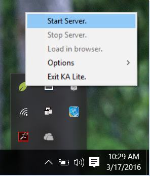

Windows
=======

#. Download the KA Lite :url-windows-installer:`Windows installer <>`.
#. Double-click the downloaded .exe file, and the wizard window will appear to guide you through the process of installing KA Lite on your server.

Upgrade
_______

Upgrading KA Lite in Windows over an existing installation is easy -- just run the installer and follow the prompts!
You don't need to uninstall your old KA Lite installation first.
You can follow the prompts to either keep your existing data or delete old data and start over.
See the :doc:`release notes <release_notes>` for critical upgrade information for specific versions.

When you start the KA Lite program, you will find a leaf icon in your task tray.
Right click on this icon to start/stop the server, open the application in a browser, or set other options:

By default, you can access KA Lite on the installation computer from the address http://127.0.0.1:8008.
To access KA Lite from other machines, you will need to connect to the same network as the installation computer and
access port 8008 using the its IP address.
For example, if the installation computer has the IP address 192.168.0.104 on your network then you can access it from
other machines on the same network at the address http://192.168.0.104:8008.

For more advanced use of KA Lite, such as changing the default port, see :ref:`running-ka-lite-with-your-own-settings`
or use the command-line ``kalite`` program, which in typical installations can be found at the path
``C:\Python27\Scripts\kalite``. Run ``kalite --help`` for usage info.

.. warning::
    If you need to download and install contentpacks locally for languages other
    than English, make sure you are doing it
    **as the same user that installed KA Lite** in the first place. If you
    perform the contentpack installation as a different user, some content will
    not load properly. For downloading and installing content packs for offline
    methods and automatic deployments, see :ref:`content_pack_retrieve_offline`.

Mac OS X
========

Installation
____________

#. Download the KA Lite :url-osx-installer:`OSX installer <>`.
#. After the download is complete, double click the .pkg file.
#. Click on the Continue button to allow the installer program to check for pre-installation requirements.
#. Follow the prompts in the installer dialog to install KA Lite.
#. The "KA Lite app" will launch automatically during installation, display notifications and a menu bar icon.
#. When the installation finishes, you will be notified that "KA Lite is running...". The installer will also show the "Summary" page with instructions to start using KA Lite.
#. To start using KA Lite, click on the menu bar icon and select "Open in Browser".

Upgrade
_______

To upgrade an existing KA Lite installation.

#. Download the KA Lite :url-osx-installer:`OSX installer <>`.
#. Make sure that you stop the server and quit the KA Lite Monitor.
#. After the download is complete, double click the .pkg file.
#. Click on the Continue button to allow the installer program to check for pre-installation requirements.
#. Follow the prompts in the installer dialog to install KA Lite.
#. The "KA Lite app" will launch automatically during installation, display notifications and a menu bar icon.
#. When the installation finishes, you will be notified that "KA Lite is running...". The installer will also show the "Summary" page with instructions to start using KA Lite.
#. To start using KA Lite, click on the menu bar icon and select "Open in Browser".

See the :doc:`release notes <release_notes>` for critical upgrade information for specific versions.

Linux
=====

Main method: Ubuntu/Debian .deb
_______________________________

Download the :url-deb-installer:`latest .deb <>` installer, and run this command::

    sudo dpkg -i FILENAME.deb

.. warning::
    Double-clicking the .deb in Ubuntu will open it in Ubuntu Software Center.
    This will fail on a default installation due to
    `a bug <https://bugs.launchpad.net/ubuntu/+source/software-center/+bug/1389582>`_
    in Ubuntu. To make it work, you need to install ``libgtk2-perl``, for
    instance by running ``sudo apt-get install libgtk2-perl``. After that, make
    sure Software Center is closed and double-click the .deb file.

``FILENAME`` should be replaced with the name of the file you downloaded.
The file may be named as if it was intended for Ubuntu but works just as well for any other Debian-based systems like
Debian, Raspberry Pi, Linux Mint etc.

You will be prompted to enter some configuration information.
You should read the on-screen instructions carefully, but some explanation is included here:

1. Choose weather you want to run KA Lite on boot or not. We recommend choosing yes, as it simplifies data management.
If you choose not to, you must manually start KA lite every time.

.. note::
    Running KA Lite as different users creates different sets of data files, so it's recommended that you run KA Lite as the same user every time.

.. image:: linux-install-startup.png
  :class: screenshot

2. If you chose to start on boot in the previous step, you will be prompted to choose the owner for the KA Lite server
process. Generally the default value is ok.

.. image:: linux-install-owner.png
  :class: screenshot

3. You will be asked to review your choices, and finally KA Lite will start automatically when installation is complete.

.. tip::
    If you want to receive automatic updates from online sources, you can
    also use :ref:`ppa-installation`.

.. _raspberry-pi-install:

Raspberry Pi
____________

For a Raspberry Pi running a Debian system, you can install the special Debian
package ``ka-lite-raspberry-pi`` (:url-deb-pi-installer:`Download as .deb file <>`).

To download and install it from command line:

.. parsed-literal::

    # Install dependencies
    sudo apt-get install python-m2crypto python-pkg-resources nginx python-psutil
    
    # Fetch the latest .deb
    sudo wget https://learningequality.org/r/deb-pi-installer-|version_major|-|version_minor| --no-check-certificate --content-disposition 
    
    # Install the .deb
    sudo dpkg -i ka-lite-raspberry-pi*.deb

You can also add the PPA, see :ref:`ppa-installation`, and then
run ``sudo apt-get install ka-lite-raspberry-pi``. 

For a more thorough guide, see :ref:`raspberry-pi-tutorial`.

Other options
_____________

KA Lite is available for all platforms (e.g. non-Debian compatible platforms)
through PyPi. See :ref:`pip-installation`.

Upgrade
_______

To upgrade KA Lite on Linux, simply download the latest deb file and follow the instructions above for installation.
Your existing data will be preserved by default.
See the :doc:`release notes <release_notes>` for critical upgrade information for specific versions.

Configuration after installation or update
__________________________________________

Every time you install or update KA Lite, you must run ``kalite manage setup`` command again to setup the database and download assessment items (video descriptions,
exercises etc.).

Uninstalling
============

Windows
_______

1. Uninstall KA Lite from the Control Panel.
2. In Windows XP, double-click the "Add or Remove Programs" icon, then choose KA Lite.
3. In later version of Windows, click the "Programs and Features" icon, then choose KA Lite.

Mac OSX
_______

1. Launch ``KA-Lite Monitor`` from your ``Applications`` folder.
2. Click on the app icon at the menu bar.
3. Click on ``Preferences`` in the menu option.
4. Click the ``Reset App`` from the ``Advanced`` tab.
5. You will be prompted that "This will reset app. Are you sure?", just click on ``OK`` button.
6. Another dialog will appear asking your ``Password``, type your password then click on ``Ok`` button.
7. Quit the ``KA-Lite Monitor`` app (do not click the ``Apply`` button!).
8. Move the ``KA-Lite Monitor`` app to ``Trash``.

Linux: Debian/Ubuntu
____________________

Option 1: Open up **Ubuntu Software Center** and locate the KA Lite package.
Press ``Remove``.

Option 2: Use ``apt-get remove <name of package>``. You have to know which
package you installed, typically this is ``ka-lite`` or ``ka-lite-bundle``.

Installed with pip
__________________

You can remove KA Lite (when installed from pip or source distribution) with
``pip uninstall ka-lite`` or ``pip uninstall ka-lite-static`` (static version).

Removing user data
__________________

Some data (like videos and language packs) are downloaded into a location that
depends on the user running the KA Lite server. Removing that directory can
potentially reclaim lots of hard drive space.

On Windows, the HOME and USERPROFILE registry values will be used if set,
otherwise the combination ``%HOMEDRIVE%%HOMEPATH%`` will be used.
You can check these values from the command prompt using the commands
``echo %HOME%``, ``echo $USERPROFILE%``, etc.
Within that directory, the data is stored in the ``.kalite`` subdirectory.
On most versions of Windows, this is ``C:\Users\YourUsername\.kalite\``.

On Linux, OSX, and other Unix-like systems, downloaded videos and database files are in ``~/.kalite``.
