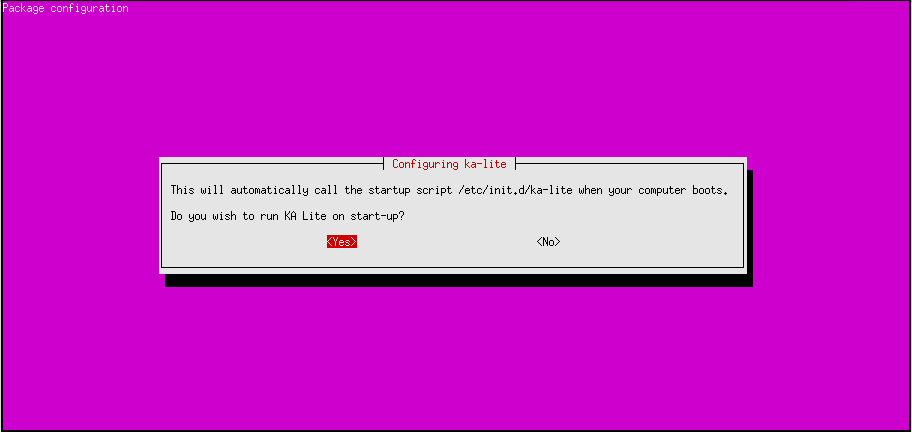
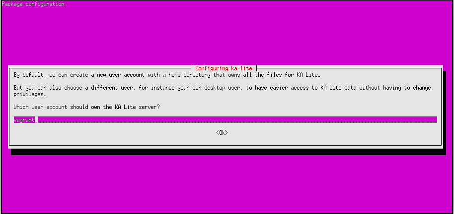

Windows
=======

#. Download the KA Lite `Windows <https://learningequality.org/r/windows-installer-0-15>`_ installer.
#. Double-click the downloaded .exe file, and the wizard window will appear to guide you through the process of installing KA Lite on your server.

Upgrading KA Lite over an existing installation is easy -- just run the installer and follow the prompts!
You don't need to uninstall your old KA Lite installation first.

Mac OS X
========

.. warning:: The latest OS X version (EL Capitan) is not yet supported.

Installation
____________

#. Download the KA Lite `OSX installer <https://learningequality.org/r/osx-installer-0-15>`_.
#. After the download is complete, double click the .dmg file.
#. Click the ``Agree`` button to accept the LICENSE agreement.
#. On the .dmg window, drag the ``KA-Lite Monitor`` app into the ``Applications`` folder.
#. Launch ``KA-Lite Monitor`` from your ``Applications`` folder.
#. On first load, it will check your current environment and show the Preferences dialog.
#. Input your preferred administrator username and password, then click the ``Apply`` button in ``KA-Lite Preferences`` dialog.
#. You will be prompted that initial setup will take a few minutes, click the ``OK`` button and wait for the notification that KA-Lite has been setup and can now be started.
#. Click on the KA-Lite logo icon on the menu bar and select the ``Start KA-Lite`` menu option.
#. Wait for the notification that you can now click on ``Open in Browser`` menu option.
#. Click on the KA-Lite logo icon on the menu bar and select ``Open in Browser`` menu option - this should launch KA-Lite in your preferred web browser.
#. Login using the administrator account you have specified during setup.

Upgrade
_______

To upgrade an existing KA Lite installation.

#. Download the KA Lite `OSX installer <https://learningequality.org/r/osx-installer-0-15>`_.
#. After the download is complete, double click the .dmg file.
#. Click the ``Agree`` button to accept the LICENSE agreement.
#. On the .dmg window, drag the ``KA-Lite Monitor`` app into the ``Applications`` folder.
#. Give confirmation to overwrite the existing app.
#. Launch ``KA-Lite Monitor`` from your ``Applications`` folder.

.. tip::
    If the sidebar shows entries that are greyed-out, the child items of the entry may be videos that were not yet downloaded.  If there are assessment items inside, then you need to extract the `assessment.zip` manually:

    #. Launch ``KA-Lite Monitor`` from your ``Applications`` folder.
    #. Click on the app icon at the menu bar.
    #. Click on ``Preferences`` in the menu option.
    #. Go to ``Advanced`` tab, click on the ``Extract Assessment`` button, then confirm the action. 
    #. Restart the server, login to the web app, then check the sidebar contents.

    This will enable the greyed-out assessment items on the sidebar.

Linux
=====

Main method: Ubuntu/Debian .deb
_______________________________

Download the latest .deb manually from
`our server <https://learningequality.org/r/deb-bundle-installer-0-15>`_.
After that, you can install the .deb file like this::

    sudo dpkg -i FILENAME.deb

``FILENAME`` should be replaced with the name of the file you downloaded.
The file may be named as if it was intended for Ubuntu but works just as well for any other Debian-based systems like
Debian, Raspberry Pi, Linux Mint etc.

You will be prompted to enter some configuration information.
You should read the on-screen instructions carefully, but some explanation is included here:

1. You will be asked to choose to run KA Lite on boot or not. We recommend choosing yes, as it simplifies data management.
If you choose no, you must manually start KA lite every time. Note that running KA Lite as different users creates
different sets of data files, so it's recommended that you run KA Lite as the same user every time.

2. If you chose to start on boot in the previous step, you will be prompted to choose the owner for the KA Lite server
process. Generally the default value is ok.

3. You will be asked to review your choices, and finally KA Lite will start automatically when installation is complete.

.. tip::
    If you want to receive automatic updates from online sources, you can
    also use :ref:`ppa-installation`.

.. _raspberry-pi-install:

Raspberry Pi
____________

For a Raspberry Pi running a Debian system, you can install the special Debian
package ``ka-lite-raspberry-pi``.

It can be installed by downloading the latest .deb on the Pi and installing it::

    # Install dependencies
    sudo apt-get install python-m2crypto python-pkg-resources nginx python-psutil
    # Fetch the latest .deb
    sudo wget https://learningequality.org/r/deb-pi-installer-0-14 --no-check-certificate
    # Install the .deb
    sudo dpkg -i ka-lite-raspberry-pi*.deb

You can also add the PPA, see :ref:`ppa-installation`, and then
run ``sudo apt-get install ka-lite-raspberry-pi``. 

After installing, you can setup a Wifi hotspot using this guide:
:ref:`raspberry-pi-wifi`

Other options
_____________

KA Lite is available for all platforms (e.g. non-Debian compatible platforms)
through PyPi. See :ref:`pip-installation`.

Configuration after installation or update
__________________________________________

Every time you install or update KA Lite, you must run ``kalite manage setup`` command again to setup the database and download assessment items (video descriptions,
exercises etc.).

Uninstalling
============

Windows
_______

1. Uninstall KA Lite from the Control Panel.
2. In Windows XP, double-click the "Add or Remove Programs" icon, then choose KA Lite.
3. In later version of Windows, click the "Programs and Features" icon, then choose KA Lite.

Mac OSX
_______

1. Launch ``KA-Lite Monitor`` from your ``Applications`` folder.
2. Click on the app icon at the menu bar.
3. Click on ``Preferences`` in the menu option.
4. Click the ``Reset App`` from the ``Advanced`` tab.
5. You will be prompted that "This will reset app. Are you sure?", just click on ``OK`` button.
6. Another dialog will appear asking your ``Password``, type your password then click on ``Ok`` button.
7. Quit the ``KA-Lite Monitor`` app (do not click the ``Apply`` button!).
8. Move the ``KA-Lite Monitor`` app to ``Trash``.

Linux: Debian/Ubuntu
____________________

Option 1: Open up **Ubuntu Software Center** and locate the KA Lite package.
Press ``Remove``.

Option 2: Use ``apt-get remove <name of package>``. You have to know which
package you installed, typically this is ``ka-lite`` or ``ka-lite-bundle``.

Installed with pip
__________________

You can remove KA Lite (when installed from pip or source distribution) with
``pip uninstall ka-lite`` or ``pip uninstall ka-lite-static`` (static version).

Removing user data
__________________

Some data (like videos and language packs) are downloaded into a location that
depends on the user running the KA Lite server. Removing that directory can
potentially reclaim lots of hard drive space.

On Windows, the HOME and USERPROFILE registry values will be used if set,
otherwise the combination ``%HOMEDRIVE%%HOMEPATH%`` will be used.
You can check these values from the command prompt using the commands
``echo %HOME%``, ``echo $USERPROFILE%``, etc.
Within that directory, the data is stored in the ``.kalite`` subdirectory.
On most versions of Windows, this is ``C:\Users\YourUsername\.kalite\``.

On Linux, OSX, and other Unix-like systems, downloaded videos and database files are in ``~/.kalite``.
