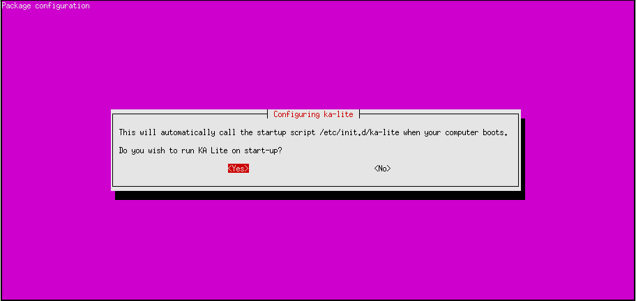
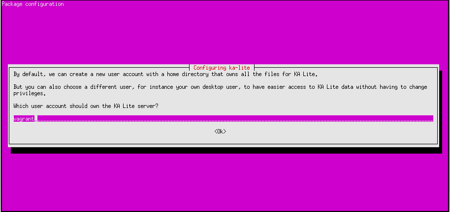
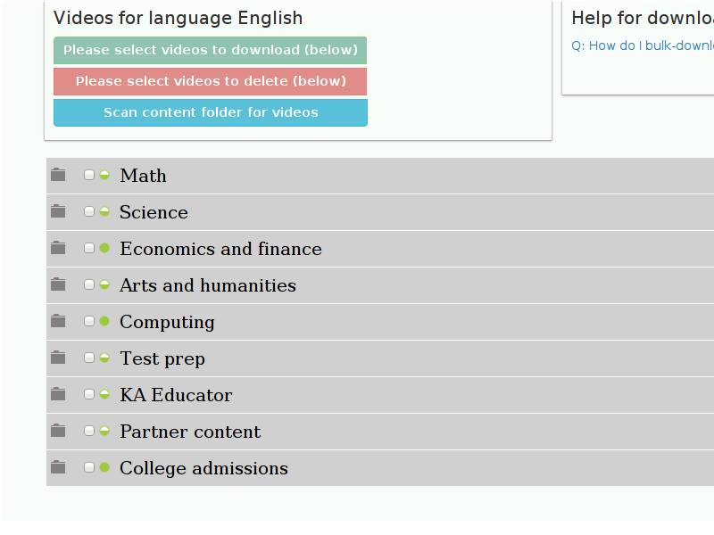
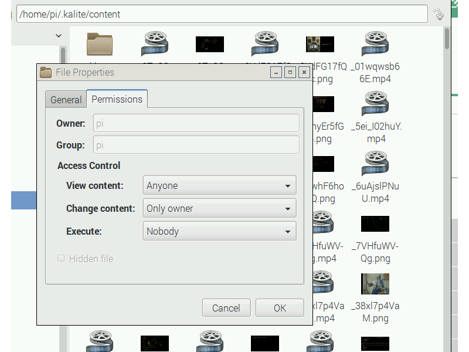

.. _raspberry-pi-tutorial:

Raspberry Pi 3 Tutorial
=======================

Raspberry Pi has many versions and the latest one is Pi 3, which this guide is
based on. It should work for older version of Raspberry Pi as well. In order to
have complete ka-lite installation one would need a 64GB MicroSD Card
(earlier version may need a SD Card) as the reduced size video are currently
34GB in size (see :ref:`system-requirements`).

Step 1: Install Raspbian
________________________

First step is to get Raspbian OS installed on Raspberry Pi. There are guides available on their website. Easy way
is to format the MicroSD Card as FAT32 and then download ``NOOBS`` (https://www.raspberrypi.org/downloads/noobs/)
Once downloaded extract and copy it on the MicroSD Card. Pi 3 has a inbuilt WiFi, hence put the Micro SD card and once 
booted it will ask to connnect to your WiFi. If WiFi isn't available make sure the ethernet port is connected and internet is
accessible. This is required to download the Raspbian OS.

After Raspbian is installed and booted, please upgrade the OS before installing the dependencies::

   # Upgrade Raspbian OS 
   sudo apt-get update
   sudo apt-get upgrade

Step 2: Install KA Lite
_______________________

You will need the customized package ``ka-lite-raspberry-pi``. To get the latest
version, see :ref:`raspberry-pi-install`.

You can also add the PPA, see :ref:`ppa-installation`, and then
run ``sudo apt-get install ka-lite-raspberry-pi``. 

Upgrades
~~~~~~~~

To upgrade KA Lite on Linux, simply download the latest deb file and install it on top of the old one (following the same installation instructions). If you use a PPA, you can run ``apt-get update && apt-get upgrade``.

Your existing data will be preserved by default.

See the :doc:`release notes <release_notes>` for critical upgrade information for specific versions.

Configuration during installation or update
~~~~~~~~~~~~~~~~~~~~~~~~~~~~~~~~~~~~~~~~~~~

Some explanation:

1. Choose weather you want to run KA Lite on boot or not. We recommend choosing yes, as it simplifies data management.
If you choose not to, you must manually start KA lite every time.

.. note::
    Running KA Lite as different users creates different sets of data files, so it's recommended that you run KA Lite as the same user every time.

2. If you chose to start on boot in the previous step, you will be prompted to choose the owner for the KA Lite server
process. Generally the default value is ok.

3. You will be asked to review your choices, and finally KA Lite will start automatically when installation is complete.

.. tip::
    If you want to receive automatic updates from online sources, you can
    also use :ref:`ppa-installation`.

During the setup it will ask to download assessment.zip that has all exercises. This file is around 500MB and it will take time depending on the internet connection.

Step 3: Usage
-------------

You will probably have chosen to start KA Lite automatically, and if that's the
case, it will already be running. Use following command to start/stop KA Lite:: 

     # Starting KA Lite
     sudo service ka-lite start
     # Stopping KA Lite 
     sudo service ka-lite stop

After starting KA Lite, point your browser to ``http://127.0.0.1:8008`` and you
should see a screen where you can type in your administrator's password.

Step 4: Downloading the videos
------------------------------

If videos are downloaded in bulk, then they need to be moved to the folder ``/home/pi/.kalite/content``. After copying the files, use the *Scan content folder for videos*. The tree will turn green for all the videos that are available in the content folder. Time taken for the scan to complete depends on the number of videos in the content folder. For the complete set of downloaded videos (``34 GB``), it can take more than 2 hours on Raspberry Pi 3. It may take longer for older versions of Raspberry Pi.

Please make sure that all these files once copied, they have permissions to be viewed by everyone (or at least the user account you know is running the KA Lite service, typically the ``pi`` user). If correct permissions are not given, videos will not play.

