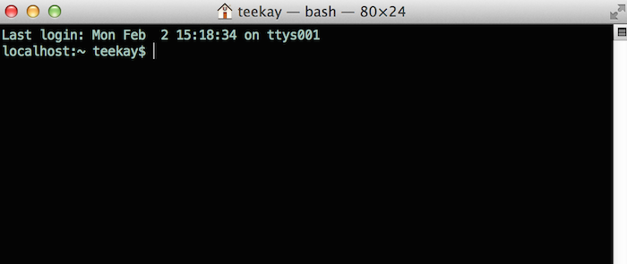

Administrator User Manual
=========================
**Who is an "administrator"?**

A person who :
    * helps to plan and oversee a project using KA Lite
    * installs and updates KA Lite
    * can create Coach logins, Learner logins, download videos and language packs

Administrator Glossary
----------------------
If you choose to register online, these important terms will help you better understand the flow of data between your installations and the online data hub.

**Sharing Network**
    A Sharing Network is a group of devices that share user data. This data is synced to the central server when an Internet connection is available, and then synced down onto other devices in the same Sharing Network.

**Organization**
    An organization is a group of people responsible for administering a set of Sharing Networks. An organization can have multiple administrators and manage multiple sharing networks.

**Facility**
    A facility is the physical space in which a device is located (e.g. a school or a computer lab in a community center). Learner, coach, and admin accounts are associated with a particular facility.

**Device**
    A device should be able to run a KA Lite server (most computers) and other devices to be used as clients. One common configuration is using a Raspberry Pi or other inexpensive computer as a server and relatively cheap tablets as client devices. Tablets can access the servers through an access point, such as a Wi-Fi dongle, or some other networking device such as a router.

**Web Browser**
    A program that retrieves and presents information resources on the World Wide Web. Popular web browsers include Internet Explorer, Google Chrome, Mozilla Firefox, and Safari.

Running the KA Lite Server
--------------------------
At the very end of the setup you are prompted to run KA Lite. Make note of the command needed to run the server - usually just ``kalite start``.

Windows or OSX behind a Firewall
________________________________

When you start KA Lite your operating system might prompt you to allow "Python.app" to accept incoming connections. The message dialogue may look like the following, depending on your operating system:

.. image:: acceptconnections.png
    :align: center

Please allow the app to run. This will make it possible for the KA Lite application to be accessible by other computers in your local network.

Accessing KA Lite
-------------------
Once the server has started, you will be given two IP addresses that you can copy and paste into a web browser to to access KA Lite.

* To access KA Lite from the same machine where the server is installed use the http://127.0.0.1:8008 IP address.
* In order to access KA Lite from other machines in your local network, use the second IP address (different from the above) listed in Terminal after running `kalite start`.

Setting up KA Lite
------------------
Once you have successfully installed KA Lite, the installation script will give you a URL (http://127.0.0.1:8008/) to visit so that you can open KA Lite and login for the first time.

    #. Copy and paste the URL into a web browser. The KA Lite application should show up.
    #. Login to KA Lite using the username and password you created during the installation process.

    * If you have forgotten the username/password combination, simply run ``kalite manage createsuperuser`` in your Terminal.

.. screenshot::
    :navigation-steps: LOGIN admin superpassword
    :focus: #id_username | Enter your username and password using this form!
    :class: screenshot

Once you’ve logged in, the next step in the setup process is to register your device with the KA Lite Hub.

Registering Your Device with the Hub
____________________________________

By registering your device with FLE, you can sync data back with our central data hub. This is useful for many reasons:

    #. The Project administrator can manage user accounts and view usage data from afar, without the need to physically visit the offline device.
    #. Syncing back usage data can inform the FLE team of multiple users in a certain geographic region, and we can connect people that might be able to help one another.
    #. It helps FLE and our partners understand where and how the software is being used, so we can keep adding features that support you!

You will have two options:

    #. **One click registration**. This is the perfect option for individual users who just want to get KA Lite up and running fast, and don't need online access to data. This allows you to get the registration process over in one-click without worrying about creating a login that you're never going to use.
    #. **Register with online access to data**. Choose this option if you're an administrator of larger projects. This option allows you to access your uploaded data and connect multiple installations to the same account.

.. warning:: If you choose to one-click register, you will unable to register with online access to data later. (If you chose this option by accident and would like to start over, navigate to the folder KA Lite is installed and re-run the setup command).

.. screenshot::
    :user-role: admin
    :url: /management/zone/
    :navigation-steps:
    :focus: li>a.not-registered-only | Click here to register!
    :class: screenshot

.. screenshot::
    :user-role: admin
    :url: /securesync/register/
    :navigation-steps:
    :focus: #one-click-register | Click here for one-click registration!
    :class: screenshot

.. screenshot::
    :user-role: admin
    :url: /securesync/register/
    :navigation-steps:
    :focus: #online-register | Or here for online access!
    :class: screenshot

How to register your device with online access to data
______________________________________________________

.. NOTE::
    You will need Internet access in order to perform these steps.

#. Log into KA Lite with the username and password that you chose during setup.
#. If you have not already registered your device, you will be redirected to a page that displays your options. Click the "Register with an online account now!" button to get started with the registration process.

.. screenshot::
    :user-role: admin
    :url: /securesync/register/
    :navigation-steps:
    :focus: #online-register
    :class: screenshot

If you do not see this page, click on the "Manage" tab. At the top of the page you should see a link similar to this, offering to register your device:

You will be prompted to log in with your central server login credentials. Please note that these credentials are different from your login credentials created during setup. Click on the "Sign up here" link, and you will be redirected to a page that prompts you to create an account on the central server.

Once you have filled out the form and submitted it, you will be sent an activation link to the email address you supplied.

Post Registration Setup
-----------------------
Now that you have registered successfully, it's time to configure your local KA Lite installation to suit your needs. If any terms like 'facility' or 'device' become unclear, check the `Administrator Glossary`_ for a quick reminder.

Create a Facility
-----------------
KA Lite assumes that you are going to be using the software primarily in one place. This could be a school, a home, a community center, etc. We call this place a “facility”, and use it to help differentiate users who are syncing back data with our central data hub. In order to create a facility, follow the steps below.

1. Log in to KA Lite.
2. Click the "Manage" tab at the top of the page.

.. screenshot::
    :user-role: admin
    :url: /
    :navigation-steps:
    :focus: .manage-tab | Click here!
    :class: screenshot

3. Make sure that the "Facilities" tab is selected.
4. Under the Facilities section, click on "Add a new facility..."

.. screenshot::
    :user-role: admin
    :url: /management/zone/None/
    :navigation-steps:
    :focus: a.create-facility
    :class: screenshot

5. Fill in the information for all the fields you find below the map
6. Click the "Save facility" button when you are finished.

.. screenshot::
    :user-role: admin
    :url: /management/zone/None/facility/new/
    :navigation-steps: #id_name click | #id_name send_keys Your School | NEXT send_keys An optional description of your school...
    :focus: input.submit | Click here to create a new facility after filling in the form above.
    :class: screenshot

7. Once the information has been saved, you will be redirected back to the "Facilities" page, where you will see a message indicating that you have successfully saved your new facility.

Delete a Facility
-----------------
1. Log in to KA Lite.
2. Click the "Manage" tab at the top of the page.
3. Make sure that the "Facilities" tab is selected.

.. screenshot::
    :user-role: admin
    :url: /management/zone/None/
    :navigation-steps:
    :focus: li.facility
    :class: screenshot

4. Find the facility you would like to delete, and click the trash can icon to delete the facility.

.. image:: trash_facility.png
.. |trash-icon-highlight| screenshot::
    :user-role: admin
    :url: /management/zone/None/
    :navigation-steps:
    :focus: span.glyphicon-trash
    :class: screenshot

5. You will be prompted to type in the name of the facility you wish to delete for confirmation.
6. If your delete is successful, you will be redirected back to the "Facilities" page, where you will see a message indicating that you have successfully deleted the facility.

User Management
---------------
Coaches and learners are the other types of users that KA Lite supports. In order for them to be able to login, you need to create accounts for them.

Adding Learners
_______________
1. Log in to KA Lite.
2. Click on the "Manage" tab at the top of the page.
3. Make sure that the "Facilities" tab is selected.
4. Select the facility that the learner will belong to.

.. screenshot::
    :user-role: admin
    :url: /management/zone/None/
    :navigation-steps:
    :focus: a.facility-name | Click the facility's name to select it.
    :class: screenshot

5. Under the "Learners" header, click on "Add a new Learner".

.. screenshot::
    :user-role: admin
    :url: /management/zone/None/facility/None/management/
    :navigation-steps:
    :focus: a.create-student
    :class: screenshot

6. You will be redirected to a page that says "Add a new Learner". Fill in all the information. The facility dropdown defaults to the facility you selected in the previous steps.
7. Click "Create user". You should be redirected to the "Facilities" page, where you will see a message indicating that you have successfully created a Learner user.

.. screenshot::
    :user-role: admin
    :url: /securesync/student/
    :navigation-steps:
    :focus: input.submit
    :class: screenshot

Permanently Deleting Learners
_____________________________
1. Log in to KA Lite.
2. Click on the "Manage" tab at the top of the page.
3. Make sure that the "Facilities" tab is selected.
4. Under the "Facilities" header, select the facility the Learner belongs to.
5. Under the "Learners" header, mark the box to the left of the Learner account you would like to delete.

.. screenshot::
    :user-role: admin
    :url: /management/zone/None/facility/None/management/
    :navigation-steps:
    :focus: .student-checkbox | You can check one or more of these checkboxes.
    :class: screenshot

6. Press the "Delete Learners" button.

.. screenshot::
    :user-role: admin
    :url: /management/zone/None/facility/None/management/
    :navigation-steps:
    :focus: #delete-learners-btn
    :class: screenshot

7. You will be prompted to confirm your decision to delete. Press "OK" to proceed.

Adding Coaches
______________
1. Log in to KA Lite.
2. Click on the "Manage" tab at the top of the page.
3. Make sure that the "Facilities" tab is selected.
4. Select the facility that the coach will belong to.
5. Under the "Coaches" header, click on "Add a new coach".

.. screenshot::
    :user-role: admin
    :url: /management/zone/None/facility/None/management/
    :navigation-steps:
    :focus: #add-a-new-coach
    :class: screenshot

6. You will be redirected to a page that says "Add a new coach". Fill in all the information. The facility dropdown defaults to the facility you selected in the previous steps.
7. Click the "Create User" button.

.. screenshot::
    :user-role: admin
    :url: /securesync/teacher/
    :navigation-steps:
    :focus: input.submit
    :class: screenshot

8. If the user was successfully created, the page will reload with a message indicating that you have created the user.

Permanently Deleting Coaches
____________________________
1. Log in to KA Lite.
2. Click on the "Manage" tab at the top of the page.
3. Make sure that the "Facilities" tab is selected.
4. Under the "Facilities" header, select the facility the coach belongs to.
5. Under the "Coaches" header, mark the box to the left of the coach account you would like to delete.

.. screenshot::
    :user-role: admin
    :url: /management/zone/None/facility/None/management/
    :navigation-steps:
    :focus: .coach-checkbox | Click a checkbox to select a coach.
    :class: screenshot

6. Press the "Delete Coaches" button.

.. screenshot::
    :user-role: admin
    :url: /management/zone/None/facility/None/management/
    :navigation-steps:
    :focus: #delete-coaches
    :class: screenshot

7. You will be prompted to confirm your decision to delete. Press "OK" to proceed.

Adding a Group
______________
You can create groups within a facility. Each group can represent a classroom, a study group, or any other way you would like to group Learners. To create a group, follow the instructions below:

1. Log in to KA Lite.
2. Click on the "Manage" tab at the top of the page.
3. Make sure that the "Facilities" tab is selected.
4. Select the facility that the group will belong to.
5. Under the "Learner Groups" header, click on "Add a new group".

.. screenshot::
    :user-role: admin
    :url: /management/zone/None/facility/None/management/
    :navigation-steps:
    :focus: #add-a-new-group
    :class: screenshot

6. Fill out the name of the group, and provide a description.
7. Click "create group".

.. screenshot::
    :user-role: admin
    :url: /securesync/group/
    :navigation-steps:
    :focus: input.submit
    :class: screenshot

8. You should be redirected back to the Facility page. If the group was successfully created, you will see it listed under the "Learner Groups" section.

Deleting a Group
________________
1. Log in to KA Lite.
2. Click on the "Manage" tab at the top of the page.
3. Make sure that the "Facilities" tab is selected.
4. Select the facility that the group you would like to delete belongs to.
5. Mark the box to the left of the group you would like to delete.
6. Press the "Delete Groups" button under the "Learner Groups" header.

.. screenshot::
    :user-role: admin
    :url: /management/zone/None/facility/None/management/
    :navigation-steps:
    :focus: .delete-group
    :class: screenshot

7. You will be prompted to confirm your decision to delete. Press "OK" to proceed.

Moving a User to a New Group
____________________________
1. Navigate to the page for the facility the user belongs to.
2. Under the "Learners" header, select the Learner you would like to move by clicking in the checkbox to the left of the Learner name.

.. screenshot::
    :user-role: admin
    :url: /management/zone/None/facility/None/management/
    :navigation-steps:
    :focus: .student-checkbox | Click this checkbox.
    :class: screenshot

3. In the dropbox, select the group you would like to move the user to.

.. screenshot::
    :user-role: admin
    :url: /management/zone/None/facility/None/management/
    :navigation-steps: .movegrouplist click
    :focus: .movegrouplist | Select one of these options!
    :class: screenshot

4. Click the "Change Learner Groups" button.

.. screenshot::
    :user-role: admin
    :url: /management/zone/None/facility/None/management/
    :navigation-steps:
    :focus: #move-learner-group-btn
    :class: screenshot

5. The page will refresh, with a message at the top indicating a successful move.

Removing Users from a Group
___________________________
If you'd like to remove a user from a group without permanently deleting the user, please follow the instructions below:

#. Follow the same instructions as for "Moving a User to a New Group", but select "Ungrouped" from the dropdown menu.

Group Summary Statistics
________________________
For each group, you should be able to view some statistics.

1. Navigate to the Learner Groups section of the facility you wish to look at.
2. Click on the group that you wish to view.

.. screenshot::
    :user-role: admin
    :url: /management/zone/None/facility/None/management/
    :navigation-steps:
    :focus: a.group-name | Click here to view group statistics!
    :class: screenshot

3. The statistics for the group should be displayed at the top of the page.

Edit User Information
_____________________
#. Navigate to the page for the facility that the user belongs in.
#. Find the user you would like to edit.
#. Click the blue pencil |bluepencil| icon next to the name of the user that you would like to edit.
#. Make all necessary changes on the edit user page, and click "Update user".
#. You will be redirected to the previous page, with a message at the top indicating that your changes have been saved.

Allowing Other Users to Connect
--------------------------------
In order for other users to be able to connect with the KA Lite from different computers, you will need to give them an IP address with which to access the software. The rest of the users should use the second IP address, different from the one you use (usually 127.0.0.1:8008 received during setup), to connect with KA Lite.

Downloading Videos
------------------

Now that you've created a facility and user accounts, it's time to add video content to your local KA Lite installation! Since the videos can take up a large amount of space, you can choose to download only the videos that you need. If your device has enough space and you wish to download all of the videos, we recommend using the `Downloading Videos in Bulk`_  option.

Downloading Individual Videos
_____________________________

After registering your device:

1. Click the "Manage" tab at the top of the page.
2. Click on the "Videos" tab.

.. screenshot::
    :user-role: admin
    :url: /update/videos/
    :navigation-steps:
    :class: screenshot

3. View subtopics by clicking on the subject of your choice. You can close them by clicking on the subject again.
4. Mark the content you wish to download by clicking the checkbox to the left of the content name.
5. Click the the first "Download n new selected video(s)" button (colored green) in the top left box of the page. The button should also show you the total number of videos you have selected to download, as well as the total size of the content.
6. Once the download is completed, video content will be ready for Learners to watch!

.. _bulk-video-downloads:

Downloading Videos in Bulk
__________________________

The full set of videos, if downloaded through the KA Lite interface, will occupy more than 150GB.
If you want to download all the videos, we also have torrent files with resized videos (~33 GB for English). To fetch all
the videos, :url-pantry:`download and open the appropriate torrent file <content/>`.

Save the videos in the ``CONTENT_ROOT`` directory of your installation. By default, that
is the ``.kalite/content/`` folder in the *home directory* of the user running KA Lite.

On Windows, navigate to something like ``C:\Documents and Settings\<username>\.kalite\content``.

.. note:: If the drive where your ``.kalite/`` folder is located does not have enough free disk space,
          you can change the path of the ``CONTENT_ROOT`` in your `Configuration Settings`_, and
          define a different folder where your want to store videos. Remember to move the files
          from your old ``/content/`` folder into the new one.

.. note:: The ``.kalite`` folder may be hidden on some systems, so you have to enable showing hidden
          files and folders in your file browser.

After you copied in the new video files or changed the ``CONTENT_ROOT`` path, you need to register those changes with KA Lite:

1. Click the "Manage" tab at the top of the page.
2. Click on the "Videos" tab.
3. Click the "Scan content folder for videos" button (third one, colored blue) in the top left box of the page.

.. screenshot::
    :user-role: admin
    :url: /update/videos/
    :navigation-steps:
    :focus: #scan-videos | Click this to search your video folder for previously downloaded videos!
    :class: screenshot

4. Once the scan is completed, video content will be ready for Learners to watch!

Adding Languages
----------------

KA Lite content is offered in several languages. If your language is available you can download the **contentpack** for it with all the available subtitles and user interface translations. After you download and install the **contentpack** for a desired language, KA Lite will give you the option to download individual dubbed videos from that language's Khan Academy YouTube channel. For more technical background about the new **contentpacks**, please refer to our `Wiki page <https://github.com/learningequality/ka-lite/wiki/Content-packs>`_.

.. warning:: If you are upgrading from a previous KA Lite version, you **MUST** update all the languages you had previously **AND** restart your server. If you are unsure on how to do this, please see :ref:`restarting-your-server`.

Download Language Packs
_______________________
To download language packs:

1. From the "Manage" page, click on the "Language" tab.
2. Select the language pack you wish to download by selecting from the drop-down menu.

.. screenshot::
    :user-role: admin
    :url: /update/languages/
    :navigation-steps:
    :focus: #language-packs-selection | Select language packs to download from this menu!
    :class: screenshot
    :registered: true

3. Click the "Get Language Pack" button.

.. screenshot::
    :user-role: admin
    :url: /update/languages/
    :navigation-steps:
    :focus: #get-language-button
    :class: screenshot
    :registered: true

4. Once the download finishes, you can see your language in the "Installed Languages". If you are upgrading from a previous version of KA Lite, you **MUST** restart your server to make the new content/language pack available for your users. If you are unsure on how to do this, please see :ref:`restarting-your-server`.

5. After the server restart, learners and coaches will be able to switch their language to any of the installed language packs. Their default will be the default that you set by clicking on "Set as default".

Delete Language Packs
_____________________
To delete language packs:

#. Log in as the administrator.
#. Click the "Languages" link in the navigation bar
#. In the Installed Languages section, there is a button for deletion of each language.

.. screenshot::
    :user-role: admin
    :url: /update/languages/
    :navigation-steps:
    :focus: .delete-language-button>button:first | Use the buttons in this column to delete language packs.
    :class: screenshot
    :registered: true

.. _restarting-your-server:

Restarting your server
----------------------

When you make configuration changes such as changing the filepath for your video content, you may need to restart your server for changes to take effect. Remember that this will cause KA Lite to become inaccessible to users until the server is running again, but it will not delete any user accounts or information that you have configured during setup.

Restart process varies depending on the OS you are running the KA Lite server on.

Restarting Your Server: Windows
_______________________________

In the system tray, right click on the KA Lite icon. Click the "Stop Server" item in the context menu. Right click on the KA Lite icon in the system tray again, and click "Start Server". If the option is not clickable, wait a while and try again or restart your computer.

Restarting Your Server: Linux
_____________________________
#. Open up your terminal. For most Linux distributions, you can do this by going to **Menu -> Accessories -> Terminal** or **Applications menu -> System -> Terminal.**

#. Type in ``kalite restart``. This should stop the server, then attempt to restart it again. The process may take up to a few minutes.

#. Once you see the script that begins with ``To access KA Lite from another connected computer, try the following address(es):`` .... you will know that your KA Lite server has been successfully restarted.

Restarting Your Server: Mac
___________________________
#. Open up your terminal. You may do this by navigating to the magnifying glass |magglass| at the top right corner of your screen, and typing in "Terminal", then hitting "Enter" on your keyboard.

#. Your terminal should be opened up. It should look a little something like the following:

#. Type in ``kalite restart``. This should stop the server, then attempt to restart it again. The process may take up to a few minutes.

#. Once you see the script that begins with ``To access KA Lite from another connected computer, try the following address(es):`` .... you will know that your KA Lite server has been successfully restarted.

.. _configuration-settings:

Configuration Settings
----------------------

Once you have deployed KA Lite to a computer, there are a number of ways you can customize the behavior of your installation. Below, you will find a list of these possible customizations with instructions or descriptions on how to do it.

.. warning:: Please follow these instructions carefully! Customizing the server incorrectly can break your installation. It can be very hard to find and undo the error.

.. _running-ka-lite-with-your-own-settings:

Running KA Lite with your own settings
______________________________________

In a text editor, open up ``/home/user/.kalite/settings.py`` (on Windows, locate something like
``C:\Documents and Settings\<username>\.kalite``). That file is where you should
put your custom settings, and KA Lite will load them automatically.

You can also run the ``kalite`` with a completely different Python settings
module by specifying ``kalite <command> --settings=my_settings_module``.

.. note:: The ``.kalite`` folder may be hidden on some systems, so you have to enable showing hidden
          files and folders in your file browser.

Changing base settings
______________________

By default, ``/home/user/.kalite/settings.py`` will load ``kalite.project.settings.base`` which are the basic settings. But you can also load Raspberry Pi settings by changing the file to read something like::

  from kalite.project.settings.raspberry_pi import *
  # Put your settings here, e.g.
  # MY_SETTING_VAR = 123

Available settings
------------------

See above for instructions on where to configure these settings.

Most common settings
____________________

* ``DEBUG = <True or False> (default = False)``
  Enables debug mode. In case you run into technical issues, enable this setting before troubleshooting / reporting.
* ``CONTENT_ROOT = "<path to desired content folder>" (default=/home/user/.kalite/content)``
  This is the path that KA Lite will use to look for KA Lite video files to play.
  Change the path to another local directory to get video files from that directory.
  NB! Directory has to be writable for the user running the server in order to download videos.
* ``TIME_ZONE = <desired time zone>  (default = "America/Los_Angeles")``
  You can set this to be the local time zone for your installation. Choices can be found here.
* ``LANGUAGE_CODE = "<desired ISO 639-1 Language Code>" (default = "en-us")``
  You can set this to the desired language code for this installation (All choices can be found here).  If there are translations available, our web server will show them in KA Lite. Soon, we hope to provide support for internationalized content inside the KA Lite interface.
* ``USE_I18N = <True or False> (default = True)``
  If you set this to False, our web server will make some optimizations so as to avoid loading internationalization tools. Things might run a little faster, but you won't have support for translated content.
* ``USE_L10N = <True or False> (default = False)``
  By default, this is set to False. If you set this to True, Django will format dates, numbers and calendars according to the current locale. For example, January 5, 2000 would be 1/5/2000 if locale = "en-us" and 5/1/2000 if locale = "en-gb"
* ``USER_FACING_PORT = 123``
  When KA Lite is running behind a proxy (for instance Nginx or Apache), you
  probably want users to be accessing KA Lite from a different port than the
  service itself is running from. Setting this option will change certain
  system messages to use a different port. It does not affect the port that
  KA Lite is using.

User restrictions
_________________

* ``LOCKDOWN = <True or False> (default = False)``
  With this setting, users must be logged in order to access videos & exercises
* ``DISABLE_SELF_ADMIN = <True or False> (default = False)``
  Disables user sign ups.
* ``HIDE_CONTENT_RATING = <True or false> (default = False)``
  Hides content feedback, i.e. the star rating box below videos

Online Synchronization
______________________

* ``USER_LOG_MAX_RECORDS = <desired maxium for user log records> (default = 0)``
  When this is set to any non-zero number, we will record (and sync for online tracking) user login activity, summarized for every month (which is configurable, see below).  Default is set to 0, for efficiency purposes--but if you want to record this, setting to 1 is enough!  The # of records kept are not "summary" records, but raw records of every login.  These "raw" data are not synced, but are kept on your local machine only--there's too many of them.  Currently, we have no specific report to view these data (though we may have for v0.10.1)
* ``USER_LOG_SUMMARY_FREQUENCY = <desired frequency (number, amount of time)>``
  ``(default = (1, "months")``
  This determines the granularity of how we summarize and store user log data.  One database row is kept for each student, on each KA Lite installation, for the defined time period.  Acceptable values are:
  (1, "months"), (2, "months"), (3, "months"), (6, "months") - separate logged data for every month, 2 months, 3 months, or 6 months, respectively
  (1, "weeks") - separate logged data for every week ** NOTE THIS MAY PRODUCE A LOT OF DATA **
* ``SYNC_SESSIONS_MAX_RECORDS = <desired max records of sync sessions> (default = 10)``
  Every time your installation syncs data, we record the time of the sync, the # of successful logs that were uploaded and downloaded, and any failures.
  This setting is how many such records we keep on your local server, for display.
  When you log in to our online server, you will see a *full* history of these records.
