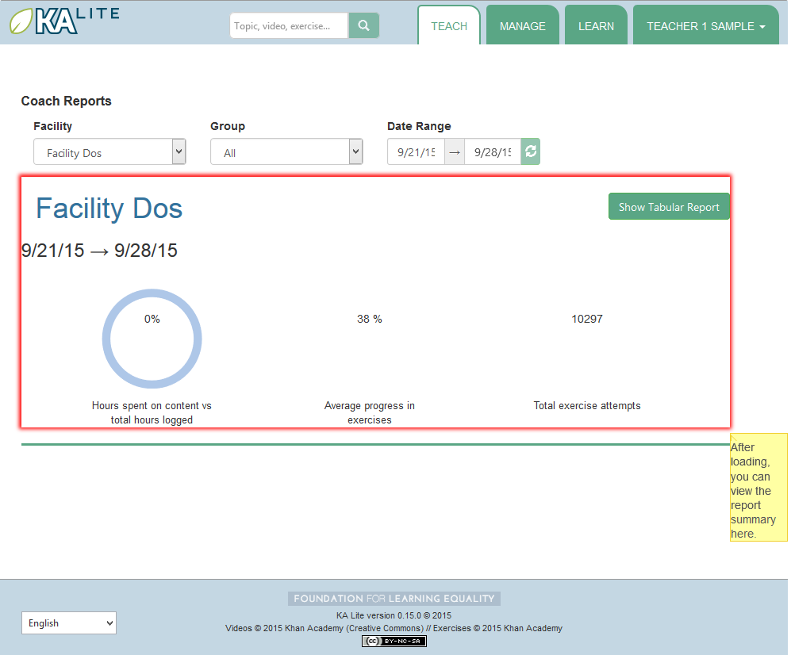

Coach User Manual
=================

**Who is a "coach"?**

A person who :
    * adds, manages, and tracks the progress of groups of students.
    * has access to student progress data in the form of coach reports
    * provides instructions to students
In addition, by default, coaches can:
    * create coach logins, Learner logins, download videos and language packs

(This can be disabled by the administrator with the RESTRICTED_TEACHER_PERMISSIONS setting)

Coach Reports
-------------

Coach reports are visualizations of the data generated by your learners. The goal of the coach reports is to put the data into an easy to understand format, so you can understand how learners are progressing and where they need the most help.

The Report Page displays an overview of the learners and a tabular report.

Overview
^^^^^^^^

1. Select the "Teach" tab at the top of the page.
2. Select the appropriate facility from the drop down menu to view reports for a specific facility.
3. Select a group from the drop down menu to view the overivew for a specific group or leave the group as is.
4. The display should refresh with the data requested, for student activity from the previous week onwards.
5. To view data over a longer period, select the start and end date using the time picker, and click the 'refresh' icon next to the time picker.

The overview will display the activity of the group: the percentage of hours logged on content versus exercises, the average progress in exercises, and the total exercises attempted.

Tabular Report
^^^^^^^^^^^^^^

A tabular report is a grid that can show how students are doing in specific subjects at a high level.
As a coach, you can select which group of students you'd like to check progress for, and which subset of videos or exercises you'd like to see reports on.
This allows you to easily identify which areas learners are struggling in, as well as which learners are doing well.

1. Click the "Show Tabular Report" button at the bottom of the page.

.. screenshot::
    :user-role: coach
    :url: /coachreports/coach/zone/None
    :navigation-steps:
    :focus: #show_tabular_report | Click here to expand the tabular report.
    :class: screenshot

Progress By Topic
^^^^^^^^^^^^^^^^^

1. Click on the "Show Tabular Report" button.
2. A table should be generated with the data requested.

The color of the rectangles in the table indicate how that student is doing on a particular exercise. The following key explains the color code of the table cells (this information will also be available on the Coach Report page):

+----------------------+-------------------------------------------------------------+
| .. image:: gray.png  | Not Attempted: The student has not attempted the subtopic.  | 
+----------------------+-------------------------------------------------------------+
| .. image:: blue.png  | In Progress: The student has completed a few questions.     |
+----------------------+-------------------------------------------------------------+
| .. image:: red.png   | Struggling: The student is struggling on the subtopic.      |
+----------------------+-------------------------------------------------------------+
| .. image:: green.png | Completed: The student has completed the subtopic.          |
+----------------------+-------------------------------------------------------------+

Detailed View
^^^^^^^^^^^^^

1. Click on the colored cells.
2. A panel should open up below the cell to reveal the number of questions attempted and the actions made on each exercise. 
3. Click on the same cell to close the panel. 

Inline Help
-----------

KA Lite has an inline help system on some pages.
On parts of the site where it is available, you can find a "Show me how!" button.
If you click this button, you can view a guided tour of the currently shown interface.

Exporting User Data
-------------------

On the facility management page, you can find the "Export Data" button.
If you click this button, you'll be taken to a page where you can export some user data in CSV format.
This is so you can perform analyses on data accumulated in KA Lite using your own methods -- in the future such tools may be included in KA Lite itself!
You can select which resource you wish to export, and narrow down the list of users to draw data from by selecting facilities and groups.
When you have made your selection, click the "Export" button to download a CSV file with the requested data.

.. _export-content-rating:

Content Ratings
^^^^^^^^^^^^^^^

Select the "Ratings" option in the "Resources" dropdown.
Ratings are tied to users and content items -- each rating has a unique-together user, content type, and content id.
The content id is suppressed in the output as it is not human readable, but is replaced with the title.
The title of content items may not be unique -- for example a video and an exercise might have the same title.
In such cases, you can differentiate using the content type.
