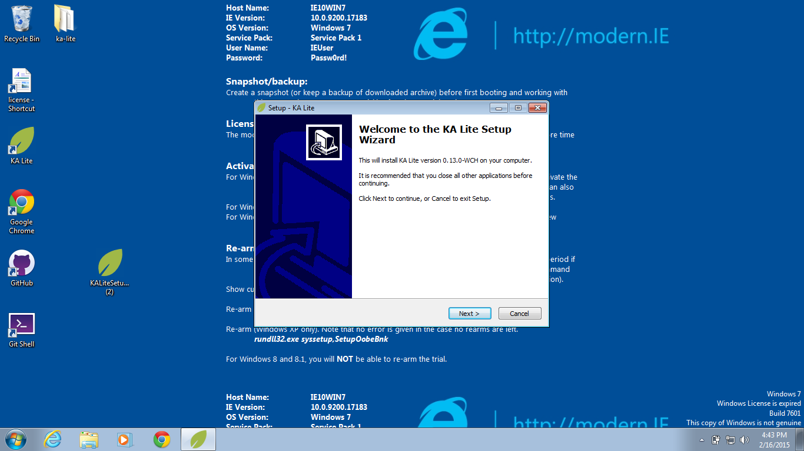
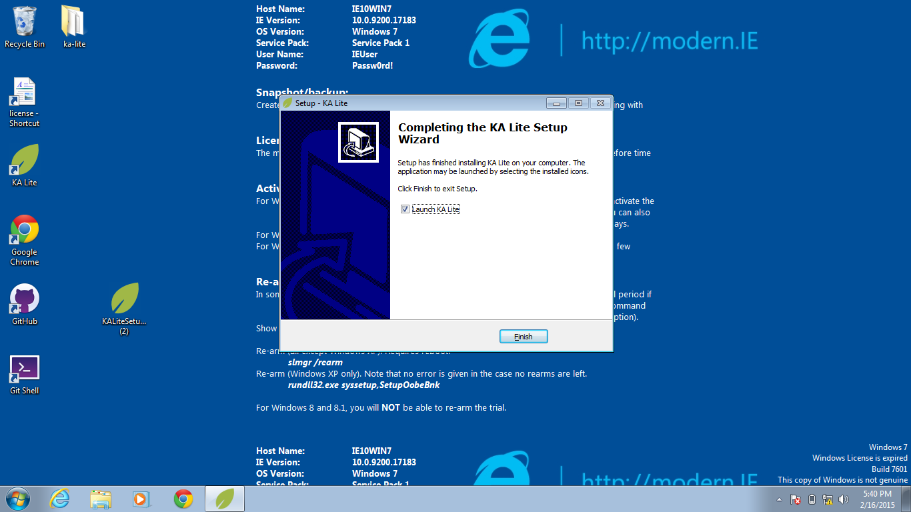

Windows Installation Guide
===========================

1. Download the KA Lite `Windows <https://learningequality.org/r/windows-installer-latest>`_ installer. You should see this pop-up on your screen.

2. After downloading the .exe file, double click it. A window will appear and guide you through the process of installing KA Lite on the server. When you are finished you should see this image.

